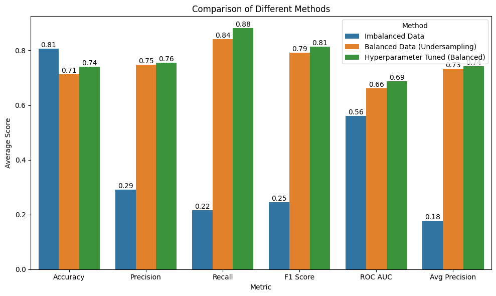
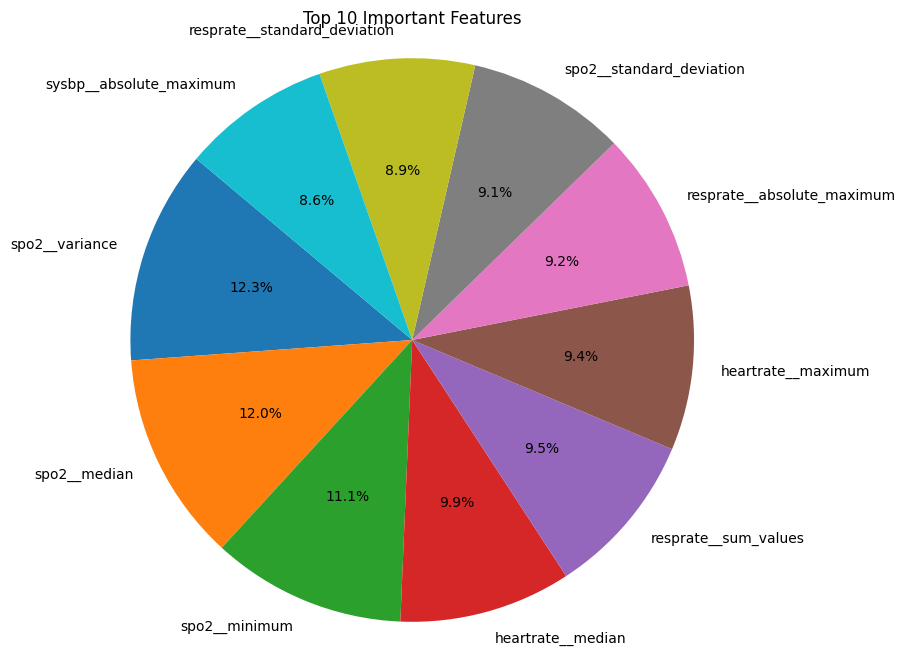

# Machine Learning Assisted Medicine: Strokes

## Introduction

Stroke is a major public health concern in the USA and worldwide, 
accounting for significant morbidity and mortality. In the USA alone, 
stroke is the fifth leading cause of death, with an estimated 795,000 
cases annually, and the leading cause of serious long-term disability [1]. 
This repository focuses on predicting stroke outcomes, with a specific 
emphasis on intracerebral hemorrhages (ICH).

## Authors

- Chashi Islam: Computer Science Department, Florida State University, 
Tallahassee, FL, 32306, USA
- James Gray: Statistics Department, Florida State University, 
Tallahassee, FL, 32306, USA
- Renata Schama: Scientific Computing Department, Florida State 
University, Tallahassee, FL, 32306, USA

## Background

This project aims to develop a machine learning model that hospitals can 
use to make better decisions regarding patient care after an ICH event. 
The predictive model will be built using time-series data from patients' 
vital signs and text from radiology reports.

## Data

The dataset consists of time-series vital sign measurements and radiology 
reports from 2,089 patients hospitalized due to cerebral hemorrhaging. The 
data is imbalanced, with over 80% of patients surviving (307 patients 
died, 1,776 survived).

## Methodology

### Radiology Reports

Radiology reports were cleaned and summarized using the GPT3.5-turbo model 
from OpenAI. However, the clinicalBERT model trained on the summarized 
reports showed high bias and performed poorly.

### Time-Series Data

Preprocessing involved handling missing values and performing feature 
extraction using the tsfresh package. We experimented with two 
dimensionality reduction techniques: PCA feature engineering and feature 
selection.

### Model Training

The final dataset with 100 selected features was used to train several 
models, including Logistic Regression, Naive Bayes, Support Vector 
Machine, Random Forest, Gradient Boost, AdaBoost, and XGBoost. The Random 
Forest model performed the best with an accuracy of 70.86%, precision of 
71.64%, recall of 69.98%, and F1 score of 70.60%. The XGBoost model achieved the following evaluation metrics on the test set:

Accuracy: 74.11%
Precision: 75.51%
Recall: 88.10%
F1 Score: 81.32%
ROC AUC: 68.70%
Average Precision: 74.14%
The XGBoost model showed relatively high accuracy, precision, and recall, indicating that it was able to make accurate predictions and effectively identify positive samples (mortality cases). However, the ROC AUC score suggests that the model's ability to discriminate between positive and negative samples is somewhat limited.

## Results and Discussion

While the model based on radiology reports did not yield satisfactory 
results, the time-series data analysis produced a promising model for 
predicting stroke outcomes. The XGBoost and Random Forest model with 100 selected 
features showed good performance in identifying patients at higher risk 
after an ICH event.

## Next Steps

- Address data bias: The dataset is biased towards the white race, and 
efforts will be made to improve fairness in data representation.
- Improved modeling of radiology reports: Extracting specific information, 
like diabetes, Glasgow Coma Scale scores, and other known indices, might 
yield better results.
- Multivariable analysis: Incorporating the number of radiology reports 
for each patient within the 24-hour window could be beneficial.
- Earlier intervention strategies: Exploring the use of the same analyses 
for the first few hours after an event to improve patient outcomes.

## References

1. CDC: https://www.cdc.gov/stroke/docs/Know_the_Facts_About_Stroke.pdf
2. World Stroke Organization: 
https://www.world-stroke.org/assets/downloads/WSO_Global_Stroke_Fact_Sheet.pdf
3. Relevant research papers on ICH and stroke outcome prediction.
4. TSFresh (time series feature extraction): 
https://tsfresh.readthedocs.io/en/latest/

